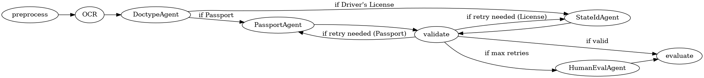

# Identification Document Extraction using Fireworks AI

This project demonstrates a few end-to-end proof-of-concepts for extracting structured information from images of U.S. identification documents (drivers licenses, state IDs, and passports) using Fireworks AI.

## What's Inside
There are 2 Document Inlining and a JSON Structured Response that are used n the main docker container.

I also built out a sample agent using LangGraph with the following setup.
. Unfortunately, I ran out of time before making it robust or dockerized, or using more than 1 image. There's a LOT to fix on the agent setup, including using a better data cleanup. the validation and evaluation scores would drastically increase. This is a perfect use case for a vertical and agents.

## Quick Notes
- The goal here was to be able to show a client some of the cool things unique to the Fireworks AI, including the document inlining and structured response integration. The goal was to show the unique adds here for structured data extraction.
- Showing the number of tokens used and costs, along with evals, is a good way to show cost/benefit to solutions
- If I had another day, I could get the agent working way better. It was the last thing I attempted
- I didn't batch the images, but that could have easily been done with the Fireworks API. Normally, that would reduce costs.
- YES, I used AI in a lot of the coding work, but I understand EVERYTHING that is going on here, it's just for speed
- I tested out standard OCR as a baselines, which uses OpenCV. I was surprised it didn't help, especially reducing the file size
- I would rather use URLs than Base64 (Base64 adds 30% to filze size over the wire), but that's what made it work here

## Key Features in Document Inlining

- **Document Inlining:**  
  The solution leverages Fireworks AI’s [Document Inlining](https://docs.fireworks.ai/firesearch/inline-multimodal) feature to process mulitple images by embedding image data directly (via Base64 encoding) into the API request.

- **JSON Mode Structured Responses:**  
  We use Fireworks AI’s [JSON Mode](https://docs.fireworks.ai/structured-responses/structured-response-formatting) to instruct the model to return results in a well-structured JSON format. This allows easy validation and further processing of the extracted data.

## Setup and Installation for Docker

1. **Clone the repository:**

   ```bash
   git clone <your-repo-url>
   cd <your-repo-directory>
    ```
2. **Create a .env file with your key:**

    ```bash
    touch .env
    echo "FIREWORKS_API_KEY=your_api_key_here" > .env
    ```

3. **Run the docker container:**

    ```bash
    docker compose up --build --force-recreate
    ```

## Setup and Installation for Agents

You'll have to set up the virtual environment and run it from there.

`pip install -r requirements.txt`

`python agents.py`

## Evaluation

### Document Inlining
The project includes a script to compare the extracted results against ground truth data (stored in actual_results.json) and compute evaluation metrics such as precision, recall, and F1 scores.

Average results without OpenCV Preprocessing (best):
```
Total tokens used for all images: 10745
Approximate cost: $ 1.0745
Precision: 0.480
Recall:    0.600
F1 Score:  0.533
```
### Agentic Approach
The agentic approach worked out really well in terms of an initial pass. The goal was to set up an agent for each state in the extraction, but that didn't happen. Here are the results however:
```
=== OVERALL IMAGE METRICS ===
Image Precision: 1.000
Image Recall: 0.538
Image F1 Score: 0.700
Correct Fields: 7
Total Predicted Fields: 7
Total Actual Fields: 13
===========================
```

